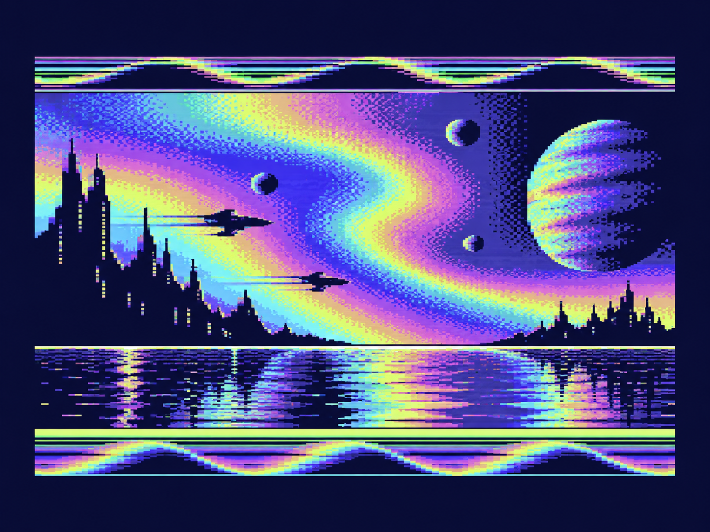

# C64 - Character FX SID Arpeggio



Visual preview asset for this effect; run the VICE command below for an emulator capture.

Text-mode PAL C64 demo with a character-graphics banner, smooth scroller, and
SID pulse arpeggio.

## Build

Requires ACME 0.97 or newer:

```sh
make
```

Output: `build/c64_chargfx_sid_arpeggio.prg`. Run with:

```sh
x64sc -autostart build/c64_chargfx_sid_arpeggio.prg
```

## Repository layout

- `c64_chargfx_sid_arpeggio.s` — corrected source.
- `custom_charset_1bpp.bin` — checked-in 2 KiB charset input.
- `Makefile`, `AUDIT.md`, and `SHA256SUMS.txt` — build, audit, and integrity data.

## Audit summary

The missing `SID_Tick` routine and charset dependency were restored. Shadow-row
arguments and centered-row state are now preserved; the `SYS 6144` contract is
unchanged.
## Documentation and license

Function-level documentation is in docs/FUNCTIONS.md. The project is released
under GPL-3.0; see LICENSE.
